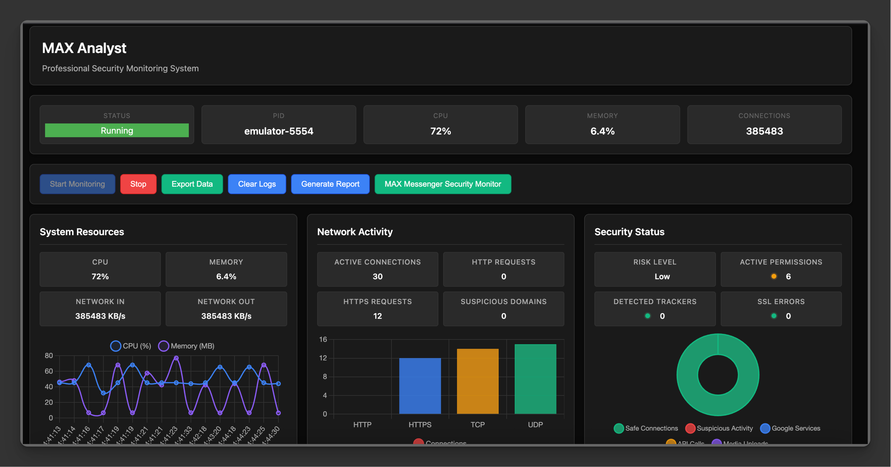

# MAX Analyst — система мониторинга безопасности MAX Messenger

Профессиональный инструмент для динамического анализа безопасности и приватности приложения MAX Messenger (`ru.oneme.app`). Система объединяет веб‑панель, бэкенд API на Flask и ADB‑интеграцию для получения «онлайн» данных с реального устройства или эмулятора Android.

## Превью

<a href="video/max-analyst.mp4">
  
</a>

*Нажмите на изображение для просмотра демонстрации системы*

## Что умеет проект

- Реальный онлайн‑мониторинг активности приложения:
  - активные сетевые соединения (TCP/UDP), HTTP/HTTPS счётчики
  - домены и классификация (Google, API, Media, Social, Suspicious)
  - события безопасности: доступ к файлам, камере, микрофону, сетевые аномалии
  - анализ разрешений и базовые метрики устройства (CPU/Memory/Network)
- Единое модальное окно «MAX Messenger Security Monitor» с детальными карточками аномалий:
  - источник/назначение (IP/порт/домен), направление (inbound/outbound), тип сервиса
  - PID/UID приложения и принадлежность соединения к процессу `ru.oneme.app`
  - тех. детали соединения: заголовки, состояние, скорость/объём
- Дэшборд с живыми графиками (Chart.js): ресурсы, сеть, статус безопасности
- Экспорт данных о подозрительной активности (JSON/CSV)
- Полностью без использования эмодзи — строгий профессиональный интерфейс и тексты

## Архитектура

- Frontend (analysis/web):
  - `index.html` — главная панель мониторинга
  - `modal.html` — модальные окна (встроенный «MAX Messenger Security Monitor»)
  - `css/style.css` — единый стиль (тёмная тема)
  - `js/services/` — сервисы: `api-service.js`, `monitoring-service.js`, `chart-service.js`, `modal-service.js`

- Backend (analysis/backend/api):
  - `simple_api.py` — основной REST API (Flask + CORS)
  - Реальные данные через ADB: `pidof`, `netstat`, `dumpsys`, `logcat`, `/proc`
  - Эндпоинты для статуса, метрик, безопасности, аномалий и экспорта

- Интеграция с ADB:
  - Определение PID `ru.oneme.app`, парсинг сетевых соединений
  - Проверка разрешений (`dumpsys package`), активности камеры/аудио (`dumpsys media.camera/audio`)
  - Чтение сетевых таблиц `/proc/<pid>/net/*` при доступности

## Онлайн‑данные (что собирается)

- Сеть: количество активных соединений, HTTP/HTTPS, классификация доменов, подозрительные хосты
- Безопасность: использование «опасных» разрешений, активность камеры/микрофона, файловые операции
- Ресурсы: CPU/Memory/Net‑activity (сводно)

## Быстрый старт

Требования: установленный ADB, Android‑устройство/эмулятор, Python 3.

```bash
# Запуск всей системы (веб + API) из каталога analysis
cd analysis
./start.sh

# Веб‑интерфейс
# http://localhost:8000

# API
# http://localhost:5003
```

Если приложение ещё не установлено на устройство:

```bash
adb install analysis/web/assets/ru.oneme.app_6392_rs.apk
```

## Веб‑интерфейс

- Кнопка «Start Monitoring» запускает опрос API и обновление дэшборда
- Блоки показывают живые значения: Active Connections, HTTP/HTTPS Requests, Suspicious Domains
- Раздел «Security Status» визуализирует уровень риска и индикаторы (разрешения, трекеры, SSL ошибки)
- Детали аномалий доступны из модального окна «MAX Messenger Security Monitor» (кнопки Details у событий)

## API (основные эндпоинты)

- `GET /api/health` — проверка работоспособности API
- `GET /api/status` — статус ADB/устройства
- `GET /api/metrics` — системные метрики (CPU/Memory/Network)
- `GET /api/max-security` — комплексные данные безопасности (сетевая аналитика, события, разрешения)
- `GET /api/suspicious-actions` — список подозрительных действий + краткая сводка
- `GET /api/suspicious-actions/<id>` — детальная информация по конкретной аномалии
- `GET /api/activity-timeline` — временная шкала активности
- `POST /api/export-suspicious-data` — экспорт данных о подозрительных действиях (JSON/CSV)

Пример:

```bash
curl -s http://localhost:5003/api/max-security | jq .network_analysis
curl -s http://localhost:5003/api/suspicious-actions | jq .summary
```

## Ключевые особенности реализации

- Фильтрация сетевых событий по PID приложения `ru.oneme.app` при наличии данных
- Корректный разбор `netstat` и `/proc` для IP/портов и направления соединения
- График безопасности (`securityChart`) использует реальные метрики (безопасные соединения, подозрительная активность, Google Services, API Calls, Media Uploads), а не статические значения
- Обновление интерфейса через сервисы и «безопасные» обработчики событий (`addEventListener` вместо inline `onclick`)
- Все тексты и код без эмодзи

## Технологии

- Frontend: HTML5, CSS3, Vanilla JS, Chart.js
- Backend: Python 3, Flask, Flask‑CORS
- Android: ADB, эмулятор/устройство

## Типичный рабочий процесс

1. Подключить устройство или запустить эмулятор, установить APK
2. Запустить `./analysis/start.sh`
3. Открыть `http://localhost:8000` и нажать «Start Monitoring»
4. Анализировать дэшборд и детальные карточки аномалий
5. При необходимости экспортировать данные через API

## Полезные материалы

- ТЗ по улучшению UI: `analysis/docs/DEVELOPER_TASK_UI_IMPROVEMENTS.md`
- Основной API: `analysis/backend/api/simple_api.py`
- Веб‑интерфейс: `analysis/web/index.html`, модальные окна — `analysis/web/modal.html`

## Лицензия

Проект предоставляется «как есть» в образовательных и исследовательских целях. Используйте в соответствии с применимым законодательством.